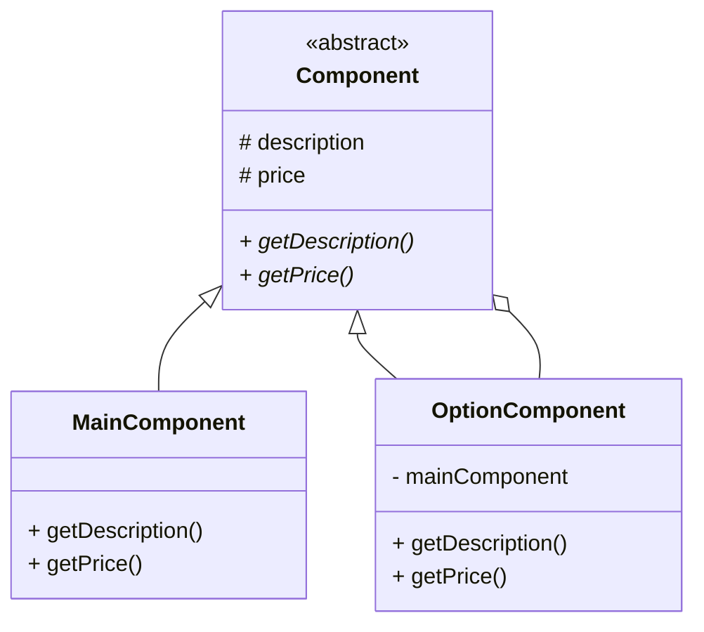

#Decorator Pattern - mẫu thiết kế người trang trí
> Decorator Pattern attachs additional responsibilities to an object dynamically.
> Decorators provide a flexible alternative to subclassing for extending functionality
>
Mẫu người trang trí gắn các trách nhiệm bổ sung cho mỗi đối tượng một cách linh hoạt.
Mẫu trang trí cung cấp một sự thay thế linh hoạt cho phân lớp để mở rộng chức năng.

