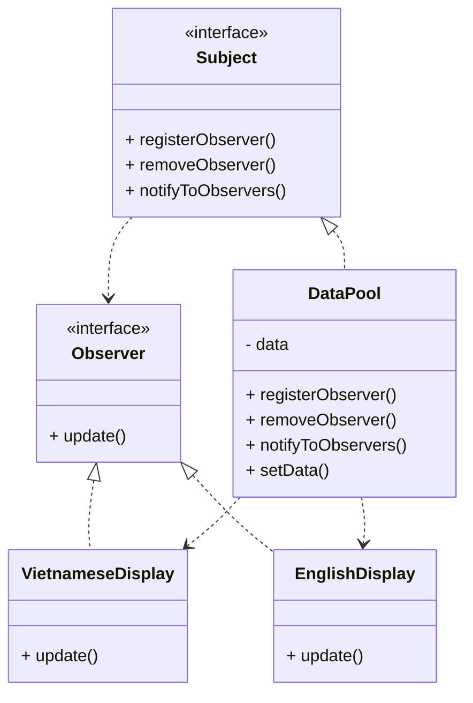

#Observer Pattern - mẫu thiết kế người quan sát
> Observer Pattern defines a one-to-many dependency between objects so that when one object changes state, all of its dependents
> are notified and updated automatically.
> 
Observer pattern xác định một phụ thuộc một nhiều giữa các đối tượng để khi một đối tượng thay đổi trạng thái,
tất cả các phụ thuộc của nó được thông báo và tự động cập nhật.

