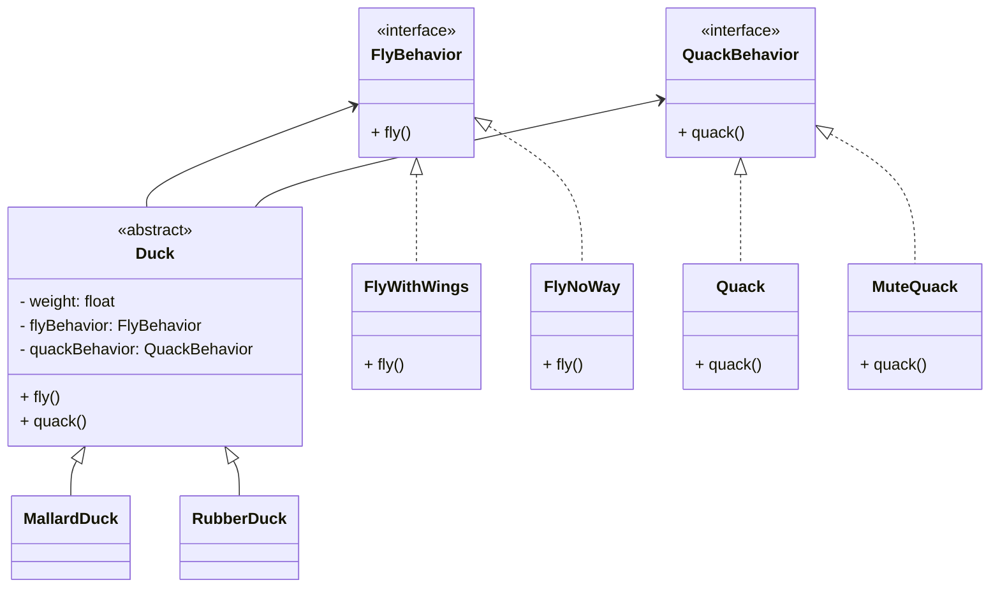

# Strategy pattern - mẫu thiết kế chiến lược
> The Strategy Pattern defines a family of algorithms, encapsulates each one, and makes them interchangeable.
> Strategy lets the algorithm vary independently from cliens that use it.
> 
Strategy pattern xác định họ các thuật toán, gói gọn từng cái và làm cho chúng có thể hoán đổi cho nhau.  
Strategy cho phép thuật toán thay đổi độc lập với các client sử dụng nó.

